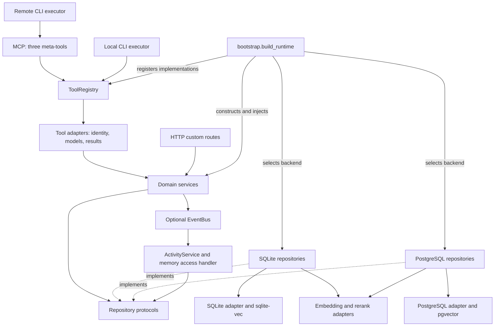

# Forgetful architecture

Reviewable, agent-authored overview, checked against the working tree on 2026-10-08.
This is a selective interpretation, not an exhaustive dependency inventory.
The component groupings below are inferred for readability; the described execution paths
and wiring were verified against source. Line numbers are inspection starting points and may drift.

Forgetful provides persistent, semantically searchable memories and related knowledge through
MCP tools, HTTP endpoints, and a CLI. Its intended boundary is
**routes → services → protocols → repositories/adapters**, as described in [AGENTS.md](AGENTS.md).
Protocols are Python contracts, not an extra runtime process: services call injected implementations.
SQL, vector storage, provider clients, and database sessions normally stay behind those contracts.
Operational exceptions are called out below rather than hidden by the diagram.

## Component view

Boxes combine multiple classes/files; they are not declared packages or separate deployments.
Solid arrows show source-verified use or explicitly labelled startup wiring. Dotted arrows mean
structural implementation of a contract, not inheritance or a request passing through a protocol.
Only memory/skill repositories use the embedding/rerank branch. Health/auth routes and operational
commands have additional paths omitted here; the diagram does not assert universal layering.

## Entry points and lifecycle

| Inspection point | Responsibility |
| --- | --- |
| [main.py:46](main.py#L46) | Server lifespan configures logging, calls `build_runtime`, attaches services/registry/scopes to the FastMCP instance, then disposes the runtime on normal shutdown. Logging is deferred to protect STDIO transport. |
| [main.py:111](main.py#L111), [main.py:305](main.py#L305) | Construct FastMCP with configured authentication; serve over STDIO or HTTP. The CORS branch wraps the HTTP app with Starlette middleware and runs Uvicorn. |
| [bootstrap.py:215](app/bootstrap.py#L215) | Composition root: choose providers and database, initialize schema, construct repositories, services, optional events, tool registry, and instance scope ceiling. |
| [bootstrap.py:185](app/bootstrap.py#L185) | `Services` and `Runtime` collect the instances for front doors; optional services are `None` when disabled. This is explicit constructor injection, not a DI container. |
| [bootstrap.py:364](app/bootstrap.py#L364) | Drain pending event handlers before closing the database; especially relevant to one-shot CLI execution. |
| [parser.py:258](app/routes/cli/parser.py#L258) | Dispatch CLI serve, re-embed, tool discovery/calls, memory/project verbs, and authentication commands. |

The bootstrap factories select PostgreSQL or SQLite repositories at
[bootstrap.py:83](app/bootstrap.py#L83), passing embedding and rerank adapters to memory/skill repositories.
`FILES_ENABLED`, `SKILLS_ENABLED`, and `PLANNING_ENABLED` control matching repositories, services,
metadata registration, and HTTP route registration. `GraphService` receives memory/entity repositories
plus the other services, including optional ones ([bootstrap.py:300](app/bootstrap.py#L300)).
Settings and validation live in [settings.py:33](app/config/settings.py#L33).

The [local executor:18](app/routes/cli/local_executor.py#L18) builds the same runtime, supplies a
CLI context, checks the instance's permitted tools, and executes the registry in process.
The [remote executor:67](app/routes/cli/remote_executor.py#L67) calls the server's three meta-tools
through an MCP client; it does not build a second local database stack.
Both conform to [ToolExecutor:10](app/protocols/executor.py#L10).

## MCP, HTTP, and identity

The active MCP surface is registered by [meta_tools.py:473](app/routes/mcp/meta_tools.py#L473):

1. `discover_forgetful_tools` lists permitted tool metadata, optionally by category.
2. `how_to_use_forgetful_tool` returns detailed metadata for a permitted tool.
3. `execute_forgetful_tool` checks the name/permissions, injects context, and dispatches it.

The full operation set is dynamic: feature flags and scopes affect what a caller sees.
[tool_metadata_registry.py:874](app/routes/mcp/tool_metadata_registry.py#L874) constructs adapter
callables and registers metadata/implementations together. Despite its filename, this is a module
of registration helpers, not a second `ToolMetadataRegistry` class.
[ToolRegistry.execute:188](app/routes/mcp/tool_registry.py#L188) looks up and awaits the callable.
[MemoryToolAdapters.create_memory:199](app/routes/mcp/tool_adapters.py#L199) illustrates identity
resolution, argument conversion, model construction, service delegation, and response formatting.
The older category `*_tools.py` registration functions also appear in the map; their presence does
not mean they are mounted by `main.py`, which registers `meta_tools` at [line 149](main.py#L149).

HTTP endpoints are FastMCP custom routes accepting Starlette requests, rather than a separate
FastAPI application despite the opening docstring in `main.py`.
[main.py:129](main.py#L129) mounts health, auth info, domain CRUD, graph, and activity routes;
files, skills, plans, and tasks are conditional. The root service-info route starts at
[main.py:114](main.py#L114). Examples:

| Surface | Source and path |
| --- | --- |
| Health / auth discovery | [health.py:19](app/routes/api/health.py#L19) `/health`; [auth.py:32](app/routes/api/auth.py#L32) `/api/v1/auth/info`. |
| Domain operations | [memories.py:178](app/routes/api/memories.py#L178) validates a create request and calls `MemoryService` directly; other domain routes follow this broad shape. |
| Graph exploration | [graph.py:42](app/routes/api/graph.py#L42) assembles a broad graph using domain services; [graph.py:968](app/routes/api/graph.py#L968) delegates bounded subgraph traversal to `GraphService`. |
| Activity history / streaming | [activity.py:48](app/routes/api/activity.py#L48) queries persisted events; [activity.py:234](app/routes/api/activity.py#L234) streams per-user events via SSE. |

[build_auth_provider:106](app/config/auth.py#L106) selects configured GitHub/Google OAuth, JWT,
or introspection providers, or no authentication. MCP identity comes from validated tokens or a
default user ([auth.py:106](app/middleware/auth.py#L106)); HTTP identity has its own bearer-token
verification/cache path ([auth.py:157](app/middleware/auth.py#L157)). Services receive an internal user ID.
[scope_resolver.py:159](app/routes/mcp/scope_resolver.py#L159) intersects token permissions with
the instance ceiling for MCP. Its empty-ceiling fallback permits all registered tools; do not
interpret an empty set as deny-all. HTTP routes do not automatically inherit registry scope checks:
inspect their own authorization path before assuming parity. This overview is not a security audit.

## Memory write, retrieval, and linking

**Create:** route/tool adapter → `MemoryService.create_memory` → repository → embedding provider
and database. [memory_service.py:169](app/services/memory_service.py#L169) applies provenance
defaults, persists the memory, then optionally finds similar memories and creates links in a batch.
The repository builds embedding text and persists associations as part of its create operation:
[PostgreSQL:191](app/repositories/postgres/memory_repository.py#L191),
[SQLite:258](app/repositories/sqlite/memory_repository.py#L258).
Memory creation and subsequent automatic linking are separate repository calls, not one service-wide transaction.

Automatic linking uses the configured neighbor limit and similarity threshold, excluding obsolete
memories and the source memory ([PostgreSQL:456](app/repositories/postgres/memory_repository.py#L456),
[SQLite:516](app/repositories/sqlite/memory_repository.py#L516)). Explicit linking is a separate
service operation ([memory_service.py:459](app/services/memory_service.py#L459)); repository link
methods maintain the bidirectional memory relation. Obsolescence is a soft state with reason and
optional replacement; create responses can additionally warn about similar obsolete memories
([memory_service.py:380](app/services/memory_service.py#L380)).

**Query:** [memory_service.py:61](app/services/memory_service.py#L61) asks the repository for
scored primary results, optionally expands one-hop links, deduplicates, and applies token/count
budgets. Project restrictions apply to primaries; linked memories use the same project filter only
when `strict_project_filter` is enabled. Budget allocation prioritizes primary results before links
([memory_service.py:595](app/services/memory_service.py#L595)). Within each tier, the budget helper
sorts by importance ([memory_service.py:672](app/services/memory_service.py#L672)); the final response
is not an untouched vector-ranking list. Scores are returned for retained primaries.

The repositories embed the query and search active, user-owned memories with optional importance
and project filters. PostgreSQL uses pgvector cosine distance
([memory_repository.py:142](app/repositories/postgres/memory_repository.py#L142)); SQLite joins
`memories` to `vec_memories` and computes cosine distance
([memory_repository.py:151](app/repositories/sqlite/memory_repository.py#L151)).
When reranking is enabled, they retrieve a larger candidate set and rerank when it exceeds `k`;
`query_context` enriches the rerank query, not the initial embedding query
([PostgreSQL:70](app/repositories/postgres/memory_repository.py#L70),
[SQLite:78](app/repositories/sqlite/memory_repository.py#L78)).

## Contracts, storage, and implementation variants

| Boundary | Implementations / inspection points |
| --- | --- |
| Domain persistence | [MemoryRepository:21](app/protocols/memory_protocol.py#L21) and sibling files in [app/protocols](app/protocols) define service-facing contracts. Pydantic domain/request/result models live in [app/models](app/models), separate from backend ORM tables. |
| PostgreSQL | [PostgresDatabaseAdapter:18](app/repositories/postgres/postgres_adapter.py#L18) owns async sessions, commit/rollback, initialization, and disposal. User sessions set `app.current_user_id`; repositories also apply user filters. Backend table definitions start at [postgres_tables.py:26](app/repositories/postgres/postgres_tables.py#L26). |
| SQLite | [SqliteDatabaseAdapter:46](app/repositories/sqlite/sqlite_adapter.py#L46) owns file/in-memory connections and sessions, loads sqlite-vec, and creates vector virtual tables. Repository queries enforce user ownership. Relational tables start at [sqlite_tables.py:31](app/repositories/sqlite/sqlite_tables.py#L31). |
| Schema lifecycle | Both database adapters run Alembic during `init_db`; backend selection and migration execution live in [alembic/env.py:1](alembic/env.py#L1), with revisions in [alembic/versions](alembic/versions). Vector-storage initialization also has adapter-specific work. |
| Embeddings | [EmbeddingsAdapter:16](app/repositories/embeddings/embedding_adapter.py#L16) defines `generate_embedding`. Implementations: local FastEmbed, Azure OpenAI, Google, OpenAI, and Ollama. Selection is explicit in [bootstrap.py:19](app/bootstrap.py#L19). |
| Reranking | [RerankAdapter:13](app/repositories/embeddings/reranker_adapter.py#L13) has local FastEmbed cross-encoder and HTTP implementations. [bootstrap.py:40](app/bootstrap.py#L40) selects one or disables reranking. |

The two persistence backends implement the same broad contracts but use different SQL/vector
mechanisms. This source review does not establish complete behavioral parity or transaction equivalence.
Provider availability, model cache contents, and live database policy configuration were not exercised.

## Other domain and operational components

These are explanatory groupings; they do not imply separate subsystems in the source tree.

| Group | Responsibilities and source anchors |
| --- | --- |
| Organization and entities | [ProjectService:33](app/services/project_service.py#L33) manages project metadata; [EntityService:47](app/services/entity_service.py#L47) manages named entities, aliases, typed entity relationships, and links to memories/projects. Memory project membership is represented by `project_ids` associations. |
| Attached knowledge | [DocumentService:40](app/services/document_service.py#L40), [CodeArtifactService:40](app/services/code_artifact_service.py#L40), and optional [FileService:40](app/services/file_service.py#L40) manage long text, source snippets, and binary content. They use separate repository contracts and can be associated with memories. |
| Procedural knowledge | Optional [SkillService:72](app/services/skill_service.py#L72) supports CRUD, semantic search, Markdown/frontmatter import/export, and links to memories/files/documents/code artifacts. Skill repositories receive the same provider adapters as memory repositories. |
| Planning | Optional [PlanService:37](app/services/plan_service.py#L37) and [TaskService:46](app/services/task_service.py#L46) manage plans, task claims, criteria, and dependencies. [transition_task:223](app/services/task_service.py#L223) validates versions, state transitions, dependencies, and completion criteria; task completion can complete the parent plan. |
| Graph views | [GraphService:73](app/services/graph_service.py#L73) combines repository traversal with domain-service lookups. [get_subgraph:129](app/services/graph_service.py#L129) bounds depth/node count and asks `MemoryRepository.get_subgraph_nodes` for traversal results across supported object types. |
| Activity and usage | Optional [EventBus:28](app/events/event_bus.py#L28) dispatches background handlers and per-user streams. [ActivityService:24](app/services/activity_service.py#L24) persists and queries events; it remains queryable when event emission is disabled. Memory read/query events optionally update access counters via [memory_service.py:723](app/services/memory_service.py#L723). |
| Re-embedding | [ReEmbeddingService:40](app/services/re_embedding_service.py#L40) coordinates full storage reset/batch embedding/validation and targeted rebuilds, using a memory contract and embedding adapter. [main.py:152](main.py#L152) is the operational CLI path. |
| Backup | [BackupService:16](app/services/backup_service.py#L16) selects SQLite file copying or PostgreSQL `pg_dump`/`psql`. This service contains implementation details, an exception to the intended service boundary. |

Additional boundary caveats: [tool_adapters.py:152](app/routes/mcp/tool_adapters.py#L152) constructs
the rebuild service by reaching through `MemoryService` to its concrete repository's embedding
adapter; this property is not the normal route-to-service contract. Re-embedding also imports text
helpers from the repositories package. These are verified coupling points, not proposed patterns.
Activity handling is asynchronous and not part of the domain write transaction; it is not a durable queue.

## Tests and validation entry points

| Suite | What to inspect / run |
| --- | --- |
| Integration | [tests/integration](tests/integration) uses stubbed I/O for service workflows. Start at [test_memory_service.py:16](tests/integration/test_memory_service.py#L16), [test_bootstrap.py](tests/integration/test_bootstrap.py), and the scope, CLI, task, skill, graph, and event-bus tests. Run `uv run pytest tests/integration/`. |
| SQLite E2E | [tests/e2e_sqlite](tests/e2e_sqlite) exercises the stack with in-memory SQLite; [conftest.py:157](tests/e2e_sqlite/conftest.py#L157) builds the app and controls optional features. Run `uv run pytest tests/e2e_sqlite/`. |
| PostgreSQL E2E | [tests/e2e](tests/e2e) exercises the PostgreSQL stack; [conftest.py:265](tests/e2e/conftest.py#L265) manages the Docker database fixture. Run `uv run pytest -m e2e` with Docker available. |
| Agent walkthroughs | [test_harness/walkthrough.py:128](test_harness/walkthrough.py#L128) orchestrates agent sessions; this is evaluation infrastructure, not a production request path. Generated run workspaces are excluded from the map. |

Backend-sensitive changes should exercise both relevant E2E suites; contract/business-rule changes
should first use the focused integration tests. Source links identify tests, not evidence that those
suites were run for this documentation-only change. Repository lint command: `uv tool run ruff check .`.

## Using the detailed map

The [Mycelium map](docs/assets/mycelium_class_diagram.md) is supporting detail, not required
reading in full. Do not load the entire file into context by default.

- Find the relevant declaration in the source index, reading that index in chunks if needed.
- Search its diagram identifier for connections and read the relevant line ranges.
- Expand to callers, contracts, alternative implementations, and tests as the task requires.
- Check relevant warnings and filtering notices. Missing edges do not establish independence.
- Verify important relationships against source; static call edges can be uncertain.

Useful IDs in this snapshot: `c0016` bootstrap, `c0276` main, `c0240` ToolRegistry,
`c0256` MemoryService, `c0120` MemoryRepository, `c0143` PostgreSQL memory repository,
`c0171` SQLite memory repository, `c0251` GraphService, and `c0264` TaskService.
The source index begins at [map line 4921](docs/assets/mycelium_class_diagram.md#L4921);
relationships at [5233](docs/assets/mycelium_class_diagram.md#L5233), warnings at
[8246](docs/assets/mycelium_class_diagram.md#L8246). IDs/positions can change on regeneration.

The map was freshly analyzed and exported using Mycelium 1.0.0 with
`--max-classes 1000 --test-path tests --test-path test_harness/runs`.
Repeating the export from the same map produced identical bytes. The output is nonempty and
contains one class diagram; it was checked as Markdown, without a rendered preview.
It contains 8,353 lines, 296 indexed boxes, 2,579 listed relationships,
and 106 extraction warnings. Test filtering removed 4,561 calls and 119 type relationships.
The box count is below the requested cap; full detail is not proof of complete extraction.

Warnings include unresolved or out-of-scope bases (`Protocol`, `BaseModel`, enums) and `EventBus`'s
`asyncio.Task` binding. These mostly name third-party/builtin types, but the diagnostics do not reliably
classify the origin of every unresolved reference. A concrete heuristic mismatch: the map attributes `TaskService.claim_task`
calling `_emit_event` to `PlanService`; source calls its own handler at
[task_service.py:336](app/services/task_service.py#L336), defined at [line 60](app/services/task_service.py#L60).
Runtime registration, decorators, and dynamic attributes require source inspection even when edges exist.

This overview is selective and does not replace source inspection. This map excludes `tests` and
`test_harness/runs`, but includes harness implementation and some debug scripts. Inspect test sources
or request a test-inclusive export when needed. Neither the overview nor the map establishes gap-free coverage.

## Maintenance

After **major code or architecture changes**, review the diagram and explanations and update them
if needed. Mycelium is optional; a source-verified manual update is acceptable. Preserve reviewed
explanations that remain accurate. Keep this overview at most 500 lines, with no column-width limit.
If the generated backup is refreshed, use fresh analysis, keep its JSON outside the repository,
and record exporter version/scope and material warnings. Recheck links and Mermaid rendering.
