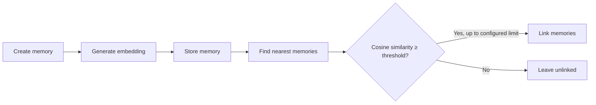

# Forgetful Search Functionality

This section details Forgetful's search functionality and associated configuration.

## Auto-Linking Pipeline

When a new memory is created, Forgetful automatically builds knowledge graph connections:

**How it works:**

1. **Encode** - Title, content, context, keywords, and tags are combined into a vector embedding
2. **Store** - The embedding is stored in the Forgetful database alongside the memory
3. **Similarity Search** - Existing memories are searched for semantic similarity
4. **Threshold** - Only matches with cosine similarity of at least 0.7 are kept by default
5. **Auto-Link** - Up to `MEMORY_NUM_AUTO_LINK` qualifying memories are linked (bidirectional)

This builds a knowledge graph where related concepts connect without manual intervention.

Set `MEMORY_SIMILARITY_THRESHOLD` to adjust the cutoff. Auto-linking does not use
cross-encoder reranking.

## Query Search Pipeline

`query_memory` searches by vector similarity. When reranking is enabled and more
than `k` candidates are returned, a cross-encoder reranks them using `query` and
`query_context`. There is no sparse full-text search or reciprocal rank fusion.

---

## Embedding Providers

### [FastEmbed](https://github.com/qdrant/fastembed)
For local embeddings and re-ranking we support the use of the excellent embedding solution developed by Qdrant. 

### [Google](https://ai.google.dev/gemini-api/docs/embeddings)
We also support Google Embedding models available via the Gemini API

### [Azure](https://learn.microsoft.com/en-us/azure/ai-foundry/openai/tutorials/embeddings?view=foundry-classic&tabs=command-line)
Support for the Azure Foundary OpenAI embeddings is now added as well. 
## Configuration
The following configuration options are available for search
